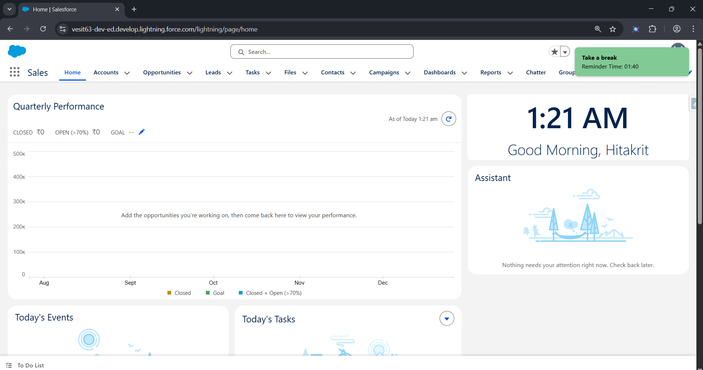

# 📦 LWC Inventory  

This repository contains Lightning Web Components (LWCs) designed for Salesforce projects.  

## 📌 Current Components  

### 🔔 Sticky Reminders Popup  
A simple LWC that shows **user-defined reminders** when the user logs in.  

- ✅ Fetches upcoming reminders from Salesforce (next 30 minutes).  
- ✅ Displays reminders in a **toast-style popup**.  
- ✅ Automatically marks reminders as **completed** in Salesforce.
- ✅ Allows closing reminders with a single click.  
- ✅ Each reminder is displayed as a **toast notification** with a color that reflects its priority:  
    - 🔵 Blue - Low Priority
    - 🟢 Green - Medium Priority  
    - 🔴 Red - High Priority

#### ⚡ LWC Component - inv_LWC001_PopupReminderController

---

✨ More LWCs coming soon inside this repo! Stay tuned. 